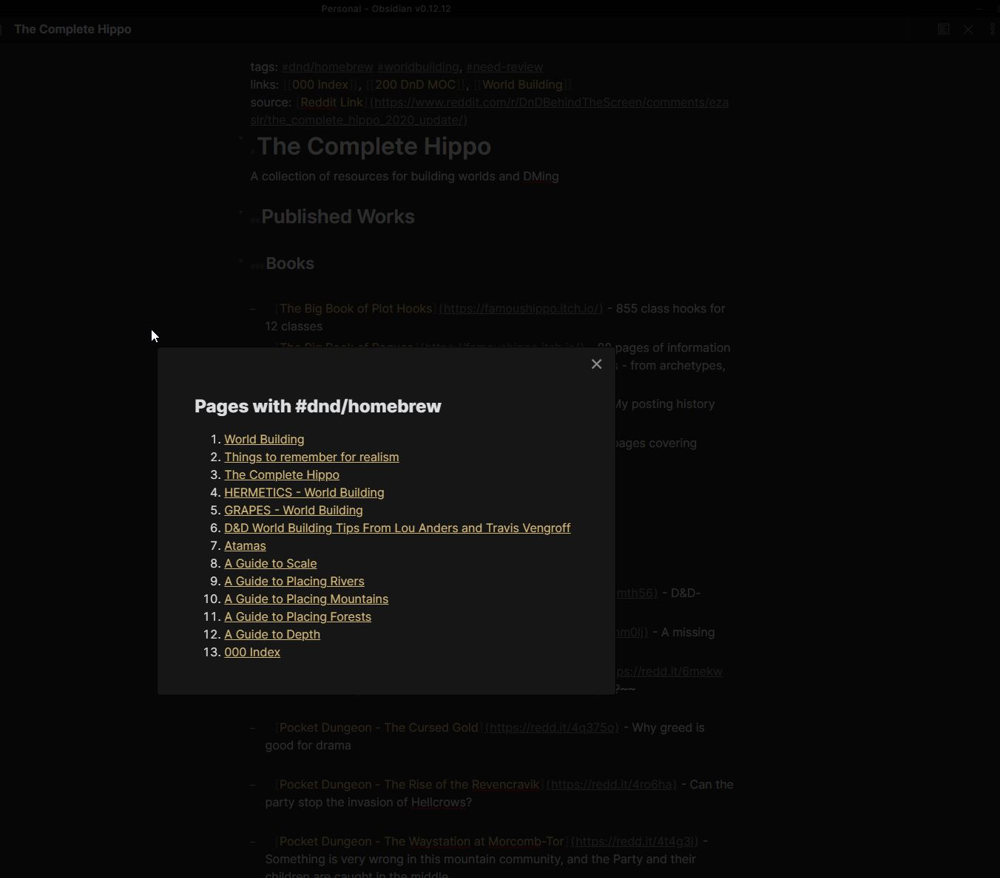

# Tag Page Preview

Clicking a tag opens a dialog listing pages that use that tag.

**To Do**
- [ ] Add some documentation
- [ ] Finish build pipleline
- [ ] Publish plugin
- [ ] Figure out how to add previews to links
- [ ] Figure out how to test an obsidian plugin




## Contributing

To make changes to this plugin, first ensure you have the dependencies installed.

```
yarn install
```

### Development

To start building the plugin with what mode enabled run the following command:

```
yarn dev
```

_Note: If you haven't already installed the hot-reload-plugin you'll be prompted to. You need to enable that plugin in your obsidian vault before hot-reloading will start. You might need to refresh your plugin list for it to show up._

### Releasing

To start a release build run the following command:

```
yarn build
```

---

<sub>This plugin was generated by [create-obsidian-plugin](https://www.npmjs.com/package/create-obsidian-plugin)</sub>
