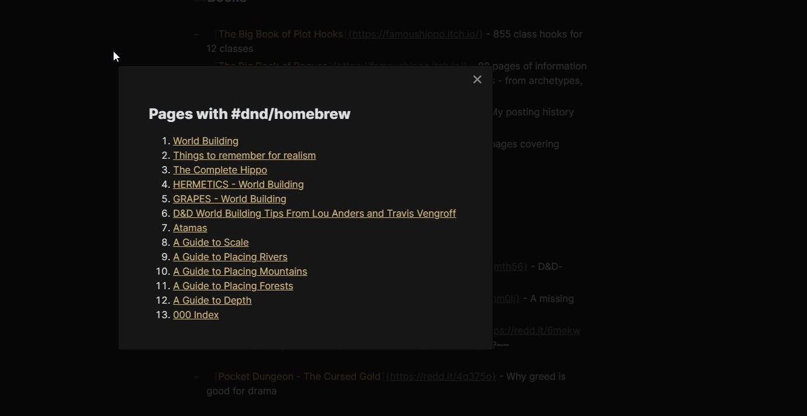

# Tag Page Preview

Clicking a tag opens a dialog listing pages that use that tag.



## Contributing

To make changes to this plugin, first ensure you have the dependencies installed.

```
yarn install
```

### Development

To start building the plugin with what mode enabled run the following command:

```
yarn dev
```

### Releasing

To start a release build run the following command:

```
yarn release
git push --follow-tags origin master
```

---
